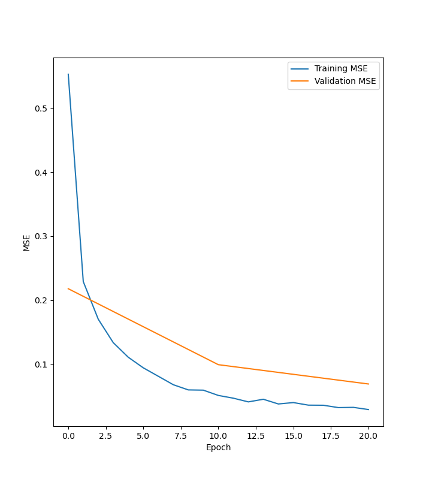

[![LinkedIn][linkedin-shield]][linkedin-url]

<!-- PROJECT TITLE -->
<div align="center">
<h3 align="center">Multilayer Perceptron (MLP)</h3>
  <p align="center">
    An implementation of a Multilayer Perceptron Neural Network
    <br />
  </p>
</div>

<!-- ABOUT THE PROJECT -->
## About The Project

This is an implementation of a Multilayer Perceptron that implements Stochastic Gradient Descent (SGD) to update the weights of the network. The network only has 2 hidden layers with sigmoid activation functions but can be easily adapted to different datasets/tasks.

### Built With


<!-- GETTING STARTED -->
## Getting Started

### Prerequisites

* PyTorch
  ```sh
  pip3 install torch torchvision
  ```
* NumPy
  ```sh
  pip3 install numpy
  ```
* Pandas
  ```sh
  pip3 install pandas
  ```
* MatPlotLib
  ```sh
  python3 -m pip install matplotlib
  ```

### Installation

1. Clone the repo
   ```sh
   git clone https://github.com/e-p-l/multi-layer-perceptron.git
   ```
2. Install prerequisites
   ```sh
   pip3 install torch torchvision
   pip3 install numpy
   pip3 install pandas
   python3 -m pip install matplotlib
   ```
3. Go to the directory and run multi-layer-perceptron.py
   ```sh
   python3 multi-layer-perceptron.py
   ```

<!-- USAGE EXAMPLES -->
## Usage
Executing the file will start the training/validation process until the validation error is below the chosen threshold. It will then output a plot of the training and validation MSE curves. Here's the results on a small dataset :
<p align="center">
  
</p>

<!-- MARKDOWN LINKS & IMAGES -->
<!-- https://www.markdownguide.org/basic-syntax/#reference-style-links -->
[linkedin-shield]: https://img.shields.io/badge/-LinkedIn-black.svg?style=for-the-badge&logo=linkedin&colorB=555
[linkedin-url]: https://www.linkedin.com/in/edouard-perrault-laliberte/
[product-screenshot]: images/screenshot.png

